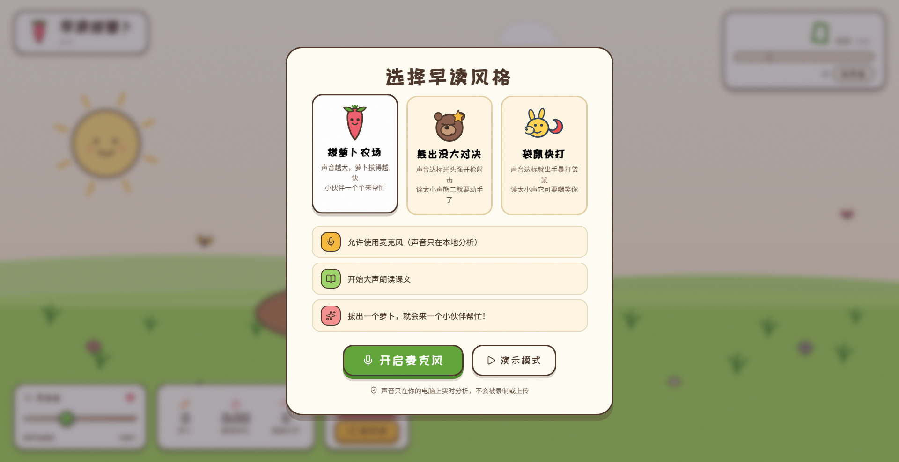
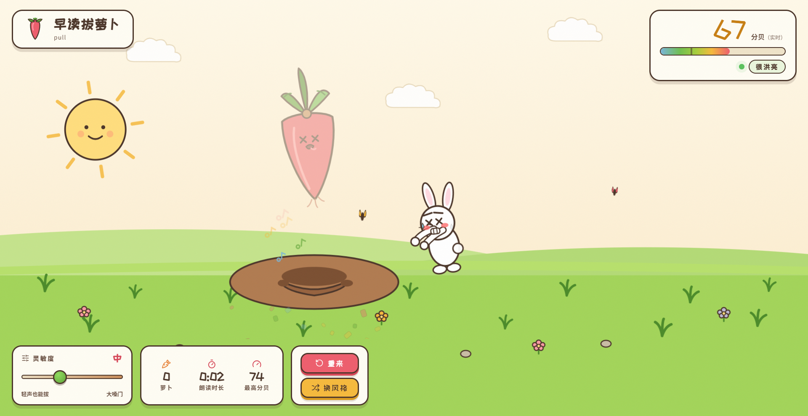
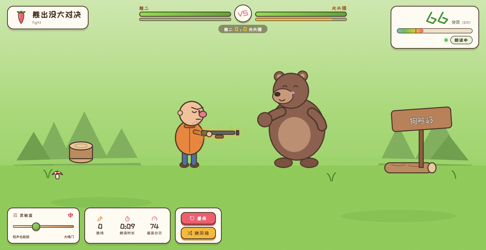
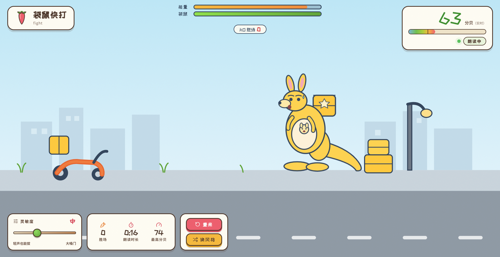
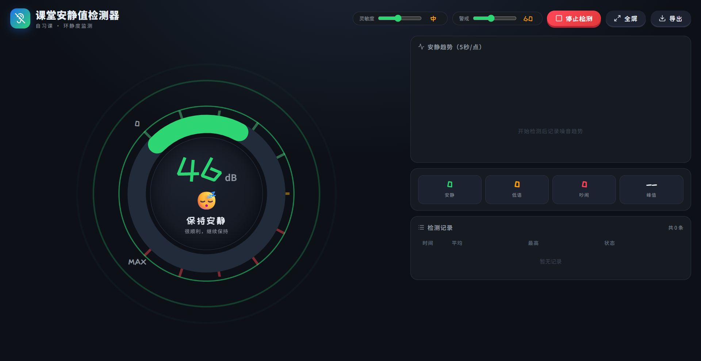

# 课堂互动工具 · 安静检测 & 早读监测

> 两个基于 **麦克风实时分析** 的课堂小工具，帮助老师管理自习课纪律、激励学生早读朗读。  
> 纯前端实现，无需服务器，数据仅存本地。

---

## 📦 包含两个独立工具

### 📖 早读朗读监测器

三大动画主题，声音越大，动画反馈越激烈。

| 主题 | 风格 | 反馈机制 |
|------|------|----------|
| 🥕 拔萝卜农场 | 温馨可爱 | 声音达标 → 小动物帮忙拔萝卜；声音不够 → 萝卜嘲笑你 |
| 🐻 熊出没大对决 | 热血对战 | 声音达标 → 光头强开枪射击；偷懒不读 → 熊二暴打光头强 |
| 🦘 袋鼠快打 | 搞笑打击 | 声音达标 → 出手暴打袋鼠；读太小声 → 袋鼠嘲笑你 |

#### 🥕 拔萝卜农场

#### 🐻 熊出没大对决

#### 🦘 袋鼠快打

- **灵敏度** 可调，适应不同教室环境
- 实时 **分贝显示** + VU 表
- 统计 **朗读时长**、**最高分贝**、**得分**
- 支持 **演示模式**（无需麦克风即可预览动画）
- 运行中可 **随时切换风格**

> 适用场景：早读课、朗读练习、语言课堂等需要激励学生开口的场合。

---

### 🎧 课堂安静值检测器

环形仪表盘实时显示分贝值，**安静 / 低语 / 吵闹** 三档状态。

- 可调节 **灵敏度** 与 **警戒值**
- 支持 **全屏** 展示，适合投屏到教室大屏
- **5 秒 / 点** 安静趋势图
- 统计安静、低语、吵闹次数及峰值
- 检测记录表格，支持 **导出 CSV**

> 适用场景：自习课、考试复习、午休管理等需要保持安静的场合。

---

## 🚀 快速开始

1. 下载任意一个 HTML 文件（`Interesting-Morning-Reading.html` 或 `Interesting-quiet.html`）
2. 用浏览器直接打开（推荐 Chrome / Edge）
3. 允许浏览器访问 **麦克风**
4. 开始使用

> 💡 没有麦克风？早读监测器支持 **演示模式**，可先预览动画效果。

---

## 🔒 隐私说明

- 所有音频分析均在 **浏览器本地** 完成
- **不会录制、不会上传、不会存储** 任何声音数据
- 无需注册、无需联网（首次加载字体和图标后即可离线使用）

---

## 🛠️ 技术栈

- **HTML5 Audio API** — 麦克风采集与实时分析
- **Canvas** — 安静趋势图绘制
- **SVG + CSS Animation** — 角色动画与表情状态机
- **Lucide Icons** — 图标库
- **Google Fonts** — ZCOOL KuaiLe / Noto Sans SC

---

